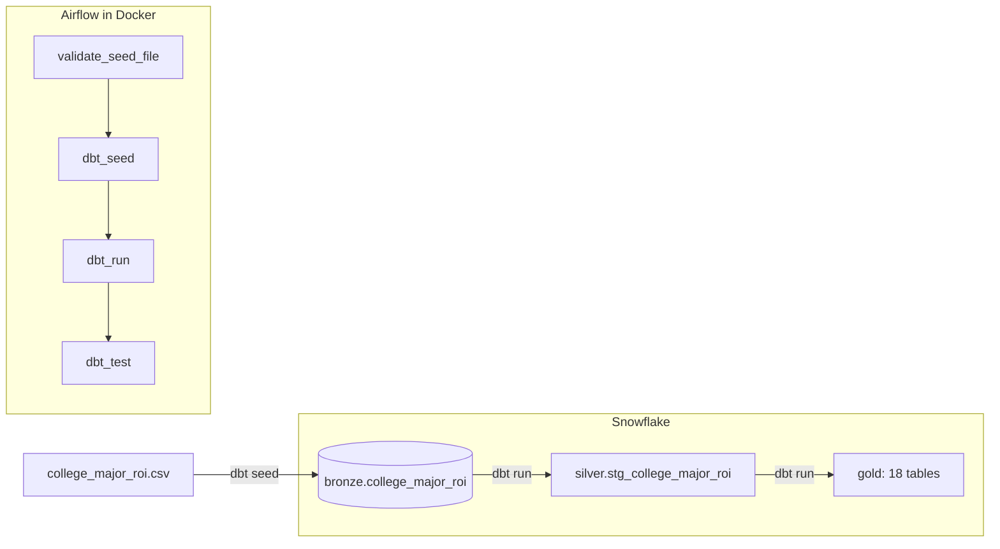

# US College ROI Analysis

An end to end data pipeline that loads a CSV of 30,000 US college graduates into Snowflake, cleans it and builds 18 analysis tables with dbt, tests everything, and runs the whole sequence from Airflow inside Docker.

Dataset: [College Major ROI](https://www.kaggle.com/datasets/sergionefedov/college-major-roi)

## What this project is

The goal was to build something that runs from start to finish instead of following separate tutorials, and to use it to ask one question: **how much does a US degree pay back, and what changes that?**

One click in Airflow does the following, in order:

1. Checks that the CSV exists and is not empty.
2. Loads it into Snowflake, untouched, as a raw table.
3. Cleans it and builds 18 tables that each answer one question.
4. Runs 49 automated tests on the result.

If a step fails, everything after it is skipped, so bad input never turns into wrong numbers.

## Architecture



Lineage graph generated by dbt docs:


Airflow run, all four tasks passing:


## The dataset

[College Major ROI](https://www.kaggle.com/datasets/sergionefedov/college-major-roi) has one row per graduate (30,000 rows, 18 columns), covering 19 majors in 7 categories, 5 school tiers and 4 US regions. It records what the degree cost, what the graduate earned over 10 years, and what they would have earned as a high school graduate. The difference, minus the cost of the degree, is the return.

| Column | Meaning |
|---|---|
| `grad_id` | Unique graduate id |
| `major`, `major_category` | Degree major (19) and its group (7) |
| `institution_tier` | ivy_elite, top_public, mid_tier, regional, for_profit |
| `institution_selectivity_pctile` | Admissions selectivity of the school |
| `gpa` | Grade point average, 0 to 4 |
| `had_internship`, `completed_on_time` | 0 or 1 flags |
| `region` | northeast, south, midwest, west |
| `net_cost_usd`, `debt_usd` | Cost of the degree after aid, and student debt |
| `hs_baseline_10yr_usd` | 10 year earnings if the graduate had stopped at high school |
| `added_earnings_10yr_usd` | 10 year earnings above that baseline |
| `earnings_10yr_usd` | Total 10 year earnings |
| `net_roi_usd` | Added earnings minus net cost |
| `roi_pct` | Net ROI as a percentage of net cost |
| `positive_roi`, `high_roi` | 1 if net ROI is above zero, or in the top quartile |

**Data quality findings**

- No nulls, no duplicate ids, no negative costs, and every category value matches the data dictionary.
- `net_roi_usd` differs from `added_earnings - net_cost` by exactly $100 in 7,554 rows (25%). Every money value in the file is a multiple of $100, so this is rounding, not corruption. The first version of my check flagged all 7,554 rows, and this is what I found when I looked into it.
- `institution_selectivity_pctile` runs from 16 to 102, and a percentile cannot go above 100. These values were left as they are.

**A caution about the data.** Net cost and student debt are almost identical for every major, graduates are spread almost evenly across majors, and every money value is a multiple of $100. That points to simulated data, so the results below describe this dataset and not the real US education system.

## What each layer does

| Layer | Schema | Contents | Built by |
|---|---|---|---|
| Bronze | `bronze` | The CSV exactly as supplied. 30,000 rows, nothing changed. | `dbt seed` |
| Silver | `silver` | Cleaned, typed and deduplicated view: `stg_college_major_roi` | dbt model (view) |
| Gold | `gold` | 18 tables, each answering one question | dbt models (tables) |

**Silver model.** `stg_college_major_roi` does the cleaning:

- Trims and lowercases the text columns so `STEM` and `stem` can never become two categories.
- Turns the 0/1 columns into real booleans.
- Keeps one row per `grad_id`.
- Adds two flag columns instead of deleting rows: `roi_calc_mismatch` (net ROI differs from its parts by more than $100) and `has_negative_value` (cost, debt or baseline below zero). Both are false for every row.

**Tests.** 49 dbt tests: `unique`, `not_null` and `accepted_values`. 12 sit on silver and 37 on gold. Tests only report, they never change data.

**Schema names.** A small macro in `macros/generate_schema_name.sql` overrides dbt's default so the layers land in plain `bronze`, `silver` and `gold` schemas instead of `dbt_schema_bronze` and so on.

## The 18 gold tables

| Table | Question it answers |
|---|---|
| `roi_by_major_category` | How does return differ across the 7 major categories? |
| `roi_by_institution_tier` | How do return and cost differ by school type? |
| `roi_by_debt_bucket` | How does return change as student debt grows? |
| `roi_stem_vs_nonstem` | STEM against everything else |
| `roi_by_major` | All 19 majors ranked by average net ROI |
| `roi_by_internship` | Does an internship change return, within each category? |
| `roi_by_completion` | What is the link between finishing on time, cost and return? |
| `roi_by_region` | Return, cost and debt by region |
| `roi_by_gpa_bucket` | Does a higher GPA go with a higher return? |
| `roi_by_selectivity_bucket` | Does a more selective school pay off? |
| `roi_major_category_by_tier` | Each category at each school type |
| `debt_to_earnings_ratio` | Debt as a share of the earnings premium, by major |
| `major_popularity` | How many graduates take each major? |
| `institution_tier_distribution` | How are graduates spread across school types? |
| `region_roi_ranking` | Regions ranked by net ROI |
| `region_hs_baseline` | Regions ranked by high school baseline earnings |
| `completion_rate_by_tier` | Share finishing on time, by school type |
| `region_cost_comparison` | Regions ranked by cost, with lowest and highest |

## Findings

Gap in average net ROI between the best and worst group of each factor:

| Factor | Best group | Worst group | Gap |
|---|---|---|---|
| Major (19) | electrical_engineering, $600,365 | fine_arts, -$39,821 | $640,186 |
| School type (5) | ivy_elite, $380,610 | for_profit, $102,770 | $277,840 |
| Finished on time | yes, $286,991 | no, $223,593 | $63,398 |
| Internship (within category) | internship | no internship | about $51,094 |
| GPA band (4) | 3.5 to 4.0, $277,386 | below 2.5, $257,427 | $19,959 |
| Region (4) | midwest, $272,086 | south, $262,998 | $9,088 |

- **Major matters most.** STEM graduates average $447,000 net ROI and arts graduates average -$39,821, at almost the same cost of about $88,000. The whole gap is on the earnings side.
- **The priciest school is not the best value.** Ivy elite schools cost $161,819 on average and return 258% of cost. Regional schools cost $65,322 and return 407%. For-profit colleges cost $119,695, return the least, and only 63% of graduates come out ahead.
- **Debt hits some majors harder.** Debt is about $38,000 for every major, but it is 7% of the earnings premium for electrical engineering and 97% for fine arts.
- **Internships help mostly in STEM and business.** The raw gap is $92,090, but that mixes in the fact that high earning majors do more internships. Within a category the gap is $85k in STEM, $62k in business and under $5k in arts and humanities.
- **Region and GPA barely move the average.**

These are averages and associations in this dataset, not causes.

## Tech stack

| Tool | Version | Role |
|---|---|---|
| Snowflake | Standard edition trial, AWS Sydney | Warehouse |
| dbt Core + dbt-snowflake | 1.12.5 + 1.12.1 | Transformations, tests, docs |
| Apache Airflow | 2.10.3, LocalExecutor | Orchestration |
| Docker | Docker Desktop | Runs Airflow and dbt together |
| Postgres | 13 | Airflow's metadata database |
| Python | 3.13 (local), 3.12 (Airflow image) | dbt install and the DAG |

## Repository layout

```
.
├── dbt_shaqxe/                     dbt project
│   ├── dbt_project.yml
│   ├── macros/generate_schema_name.sql
│   ├── models/
│   │   ├── bronze/sources.yml
│   │   ├── silver/stg_college_major_roi.sql, schema.yml
│   │   └── gold/                   18 SQL files and schema.yml
│   └── seeds/
│       ├── college_major_roi.csv
│       └── docs/data_dictionary.csv
└── airflow/
    ├── Dockerfile                  Airflow image with dbt installed
    ├── docker-compose.yaml         LocalExecutor setup
    └── dags/college_roi_pipeline.py
```

## The Airflow DAG

`college_roi_pipeline` has four tasks. Each starts only if the one before succeeded.

| Task | What it does |
|---|---|
| `validate_seed_file` | Python check that the CSV exists and is not empty |
| `dbt_seed` | Loads the CSV into `bronze.college_major_roi` |
| `dbt_run` | Builds the silver view and the 18 gold tables |
| `dbt_test` | Runs all 49 tests |

It has no schedule and is triggered by hand. Because `dbt seed` replaces the whole table each run, editing the CSV and triggering the DAG again refreshes everything, including new rows.

## Running it yourself

You will need Snowflake (the free trial is enough), Python 3.10 or newer, Git, and Docker Desktop.

### 1. Snowflake

Create a trial account, then run this in a SQL worksheet:

```sql
use role accountadmin;

create warehouse if not exists dbt_wh
  warehouse_size = 'xsmall' auto_suspend = 60 auto_resume = true initially_suspended = true;
create database if not exists dbt_db;
create schema if not exists dbt_db.dbt_schema;
create role if not exists dbt_role;

grant role dbt_role to user <your_snowflake_user>;
grant usage, operate on warehouse dbt_wh to role dbt_role;
grant all on database dbt_db to role dbt_role;
grant all on schema dbt_db.dbt_schema to role dbt_role;
```

Find your account identifier with:

```sql
select current_organization_name() || '-' || current_account_name();
```

### 2. dbt

```powershell
git clone https://github.com/shaqran39/US-College-ROI-Analysis.git
cd US-College-ROI-Analysis
python -m venv dbt-env
.\dbt-env\Scripts\Activate.ps1
pip install dbt-core dbt-snowflake
```

Create `~/.dbt/profiles.yml` (on Windows, `C:\Users\<you>\.dbt\profiles.yml`). This file holds your password, so it is not in the repo and must never be committed.

```yaml
dbt_shaqxe:
  outputs:
    dev:
      account: <ORGNAME>-<ACCOUNTNAME>
      database: dbt_db
      password: <your password>
      role: dbt_role
      schema: dbt_schema
      threads: 4
      type: snowflake
      user: <your_snowflake_user>
      warehouse: dbt_wh
  target: dev
```

Then run the project by hand:

```powershell
cd dbt_shaqxe
dbt debug
dbt seed --full-refresh
dbt run
dbt test
```

To browse the docs and the lineage graph:

```powershell
dbt docs generate --no-partial-parse
dbt docs serve --port 8081
```

### 3. Airflow

Open `airflow/docker-compose.yaml` and edit the last two lines under `volumes:` to point at your machine:

```yaml
- <path to this repo>/dbt_shaqxe:/opt/airflow/dbt_shaqxe
- C:/Users/<windows-username>/.dbt:/home/airflow/.dbt
```

The first mounts the dbt project so Airflow can run it. The second mounts the folder holding `profiles.yml` so dbt can log in to Snowflake.

Then, from the `airflow` folder:

```powershell
mkdir logs, plugins, config
"AIRFLOW_UID=50000" | Out-File -Encoding ascii .env
docker compose build
docker compose up airflow-init
docker compose up -d
```

Open http://localhost:8080 and sign in with `airflow` / `airflow` (change this if the machine is shared). Unpause `college_roi_pipeline`, click the play button and choose **Trigger DAG**. When all four tasks turn dark green, the bronze table, the silver view and the 18 gold tables are built and all 49 tests have passed.

## Things to know

- **Windows and Docker share dbt's cache.** If `dbt` fails with a `KeyError` naming a `macros` path after Airflow has run, delete the `target` folder in `dbt_shaqxe` and try again. Windows and Linux write file paths differently, so each side cannot read the cache the other left.
- **A git warning in `dbt debug` inside the container is harmless.** The project uses no git packages.
- **LocalExecutor was a deliberate choice.** Airflow's Celery setup kept crashing the worker on Docker Desktop for Windows. LocalExecutor runs tasks inside the scheduler and needs no worker or Redis, which suits a single machine.
- **`dbt seed` is slow for big files.** It took about 70 seconds for 30,000 rows. It is fine here, but much larger data should use Snowflake's bulk load instead.
- **The Snowflake trial lasts 30 days.** The pipeline can rebuild every table from the CSV in one DAG run.

## Ideas for next steps

- Add a range test for `institution_selectivity_pctile` (0 to 100), which the data currently breaks.
- Make `validate_seed_file` compare the CSV header against the data dictionary before loading.
- Build a dashboard on the gold tables.
- Add a schedule and failure notifications to the DAG.
- Break a row on purpose to show the test task catching it.
- Switch dbt to key pair authentication.

## Dataset credit

Data from [College Major ROI](https://www.kaggle.com/datasets/sergionefedov/college-major-roi) on Kaggle. Check the dataset page for its licence and terms before reusing the data.
